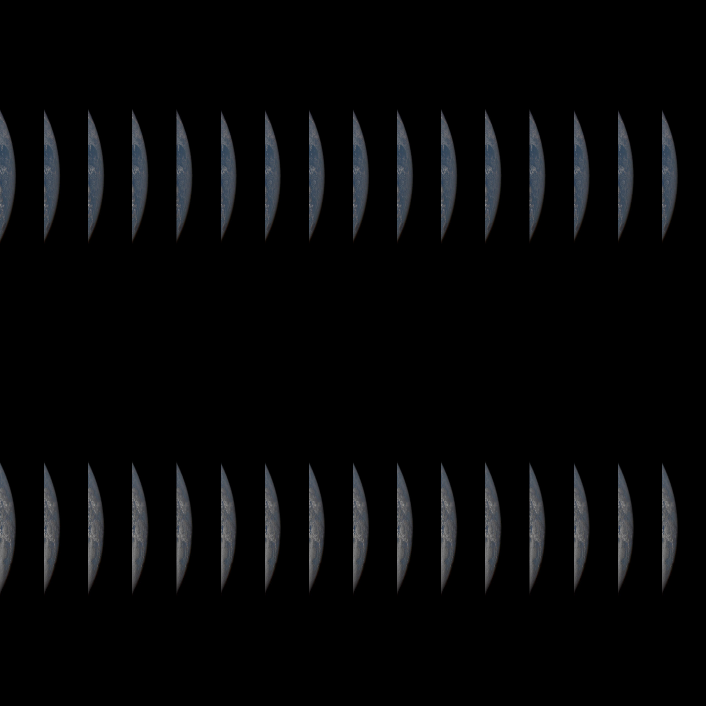

# earth

To install dependencies:

```bash
bun install
```

To run:

```bash
bun run index.ts
```

Requirements:

```bash
brew install ffmpeg
```

Functions:

```bash
fetch_image.ts - get Earth images from NASA

generate_gifs.sh - generate gifs for a date argument

four-grid.ts - joins 4 images in a 2x2 grid
```

